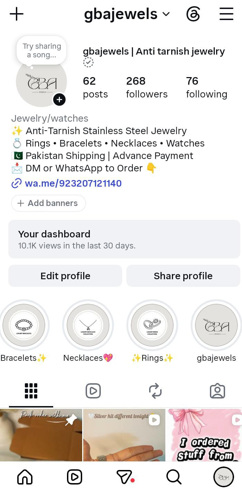

# Instagram D2C Social Commerce & CRO Audit — @gbajewels

A strategic conversion rate optimization (CRO) audit, profile redesign, and content strategy for an anti-tarnish stainless steel jewelry brand operating in Pakistan.

---

## 📸 Profile & Reach Dashboard Proof

---

## 📈 Account Metrics & Baseline Overview

* **Brand Handle:** `@gbajewels`
* **Category:** Jewelry / Watches (Anti-Tarnish Stainless Steel)
* **30-Day Organic Reach:** **10.1K Account Views**
* **Follower Base:** 268 Followers across 62 Content Posts
* **Primary Conversion Goal:** Direct WhatsApp Click-to-Chat (`wa.me/923207121140`)

---

## 🎯 CRO Bottlenecks & Strategic Solutions

### 1. Advance Payment Friction Point
* **Issue:** Demanding 100% advance payment in Pakistan's e-commerce ecosystem creates high cart abandonment for early-stage social brands.
* **Solution:** Introduced dedicated **"Customer Reviews"** and **"Unboxing Proof"** Story Highlights to build social proof and eliminate trust barriers.

### 2. Search Optimization (SEO)
* **Execution:** Optimized the profile Name line to `gbajewels | Anti tarnish jewelry` to capture organic search traffic in Pakistan.

### 3. Bio Copywriting Upgrade
* **✨ Waterproof & Anti-Tarnish Stainless Steel 🌊**
* **💍 Daily Luxury Rings, Necklaces & Bracelets**
* **📦 Nation-Wide Dispatch | Quality Guaranteed**
* **💬 Tap below to order on WhatsApp 👇**

### 4. High-Intent Content Strategy
* Recommended tarnish-testing video Reels (water and perfume immersion tests) to visually validate anti-tarnish claims and convert profile visitors into direct WhatsApp chats.

---
*Executed & Audited by **Maham Mehboob** — BBA Marketing Student & Growth Marketer.*
